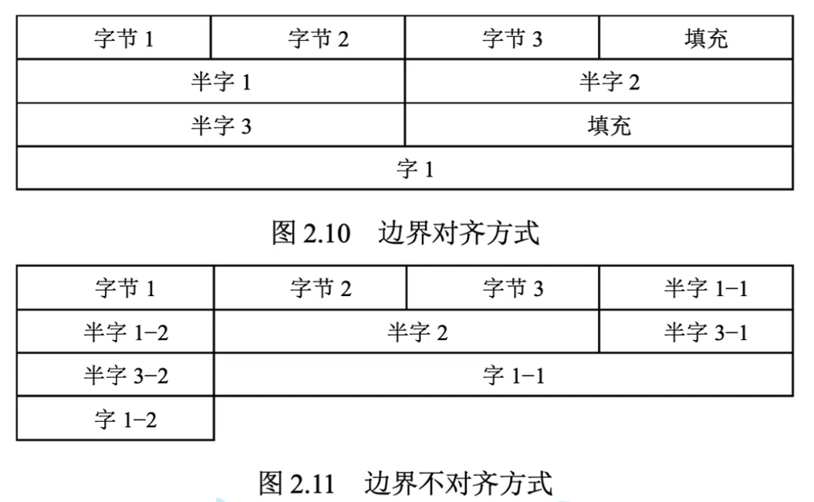

# 内存对齐


### 什么是内存对齐
内存对齐是在计算机内存中排列和访问数据的方式。它由三个独立但相关的问题组成：数据对齐、数据结构填充和打包。\

只要存储字长大于等于计算机所支持的最大的原始数据类型，那么对齐的访问始终访问单个内存字 \

[wikipedia](https://en.wikipedia.org/wiki/Data_structure_alignment)




### 为什么要内存对齐

#### 1.提高速度
CPU总按照字长读取数据（32位处理器上，32位的存储字长和数据总线的情况下为4字节32位），因此当CPU进行非对齐地址访问时，处理器可能读取多个字。在最坏情况下，访存事务总数增加两倍。

#### 2.增加访存指令可用位数

边界对齐的情况下(依然是在32位机器上，字节寻址)，任何地址位数都可以减少2位。多出的两位可以用于增加寻址空间大小，或者用于标记位。

#### 3.减少异步错误

因为一次内存的读写是原子性的，但是在非对齐的情况下，多次的内存读操作可能会被中断，在没有额外处理的情况下（加锁等?），可能导致两次读出的结果既不是更新前的也不是更新后的值。（这种情况非常少见）

#### 4.向后兼容

兼容老版本的处理器


[stackoverflow](https://stackoverflow.com/questions/381244/purpose-of-memory-alignment)

### 如何实现内存对齐

1. 对于单独的数据项，编译器通常在对其的边界上分配地址
2. 对于结构体，编译器会插入额外的padding以保持对齐要求
```
struct mystruct_A {
    char a;
    char gap_0[3]; /* inserted by compiler: for alignment of b */
    int b;
    char c;
    char gap_1[3]; /* -"-: for alignment of the whole struct in an array */
} x;
```


### 问题一：为什么结构体的开始地址需要按照最大元素大小的整数倍进行分配？

### 问题二：在编译阶段还没有分配运行时内存地址，那么编译器是如何控制内存对齐和内存对齐规则的呢？

回答：在编译过程中，编译器通过在ELF header中记录P_align来表示每个段的内存对齐方式，首先将数据在段内进行对齐，后续的链接中的对齐按照P_align中说明的对齐方式进行对齐

[stackoverflow](https://stackoverflow.com/questions/63391927/what-is-p-align-in-elf-header)


### 问题三：内存对齐是对齐虚拟内存还是物理内存？

> 虚拟内存对齐后，物理内存的对齐由操作系统完成。

### 问题四：栈和堆的对齐方式是什么样的？

> 


### 对齐规则：
1. 函数必须对齐到最小32位的边界
2. 数据元素的最小对齐方式是其本身大小
3. 大于32位的数据只需要与32位对齐


#### 概念补充：
1. CPU最小寻址单元是字节，但是每次从内存中读出的数据是一个字长
2. 如果从一个字长的数据中获取有效数据，是怎么实现的呢？通过掩码无关bit等方式，不确定具体实现方式
3. 假设存储字长是32位，那么内存条中一共4个存储单元，每个单元分别存储8个Bit，一次从4个存储单元读取连续的4个字节数据到数据总线。如果边界对齐，那么数据必定在这32位中，如果获取的数据小于32位，那么一次可以读取完成。如果边界不对齐，那么可能会需要多次访存。属于空间换时间的策略，内存便宜。

[Reference](https://softwareengineering.stackexchange.com/questions/237293/how-byte-loading-storing-is-implemented-by-the-cpu)